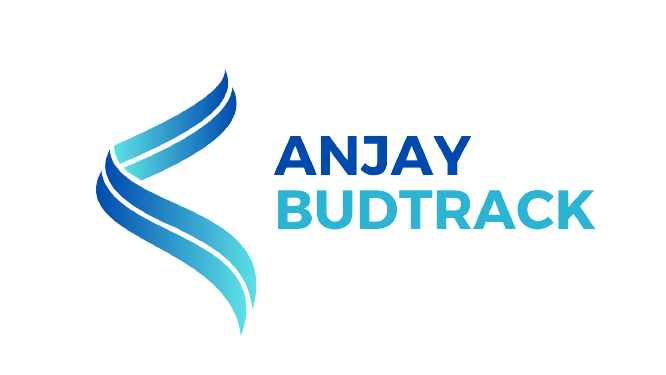

  

# BudTrack
**Your Financial Tracking Solution**

BudTrack is a collaborative project for Software Engineering that helps you manage your finances with ease. Whether you're tracking personal, family, or business expenses, BudTrack has you covered.

## Features
- **Account Management**: Easily switch between personal, family, and business accounts.
- **Balance Overview**: Get a quick view of your financial status in your preferred currency.
- **Cash Flow Analysis**: Monitor your income and expenses to make informed financial decisions.
- **Expense Categories**: Organize your spending by categories such as housing, food, transportation, and more.
- **Transaction History**: Keep a record of all your transactions for reference.

## Installation
1. Make sure you have xampp server installed on your computer
2. Clone this git repo in the "/htdocs" directory on your xampp path
3. Open phpmyadmin
4. Import the database from folder "BudTrack/database/", choose the latest file (format: ddmmyyyy_budtrack.sql)
5. Run the http://localhost/BudTrack
6. There you have it

## Big Thank You
This is project is for Software Engineering course in Sampoerna University